# Client Project Dashboard

A real-time internal dashboard for a small agency: role-based project/task management with a live, role-filtered activity feed, presence, and notifications.

- **Live app:** https://velozity-dashboard-two.vercel.app _(frontend is live; connect the backend via the Render Blueprint below to make it fully functional - see [Deployment](#deployment))_
- **Repo:** https://github.com/aayush-arya/velozity-fullstack

## Tech stack

| Layer | Choice |
|---|---|
| Frontend | React 18 + TypeScript, Vite, React Router, TanStack Query, Tailwind CSS |
| Backend | Node.js + Express + TypeScript |
| Database | PostgreSQL via Prisma ORM |
| Real-time | Socket.io |
| Background jobs | node-cron |
| Auth | JWT access token (in memory) + JWT refresh token (HttpOnly cookie) |
| Validation | Zod, on every API boundary |

## Architectural decisions

**Socket.io over native WebSocket.** The app needs three things native `ws` doesn't give you out of the box: room-based fan-out (a task update has to reach exactly the project's PM, the assignee, and every admin — no one else), an auth *handshake* (reject a bad token before a socket ever joins a room, not after), and automatic reconnection with a defined `connect` event to hook a "resync from the database" call into. Socket.io provides all three natively; with raw `ws` I'd have hand-rolled a room registry and a reconnect/backoff protocol, which is exactly the kind of infrastructure code a mature library should own. The trade-off is a slightly heavier client bundle and a protocol that isn't a plain WebSocket on the wire — acceptable here since both ends are under our control.

**node-cron over Bull/BullMQ for the overdue sweep.** The job is a single periodic query with no need for retries, backoff, distributed workers, or a job payload — it just asks "which tasks are newly overdue or no longer overdue" every 5 minutes. Bull/BullMQ would add a hard dependency on Redis purely to run something `setInterval` with extra steps can do safely. If this ever needed multiple worker instances or per-job retry semantics, Bull would be the right call — it isn't yet.

**Express over Fastify.** Fastify is faster, but this API's bottleneck is Postgres round-trips, not HTTP routing overhead. Express's larger middleware ecosystem (`express-rate-limit`, `helmet`, `pino-http`) and the fact that most engineers can read an Express codebase without ramp-up made it the pragmatic choice for a project judged partly on architecture clarity.

**Token storage.** The access token is short-lived (15 min) and kept **only in memory** on the client (a module variable, never `localStorage`/`sessionStorage`) — it's gone on tab close or reload, which limits the blast radius of an XSS-read token. The refresh token is long-lived (7 days), signed, and delivered exclusively in an **HttpOnly, SameSite cookie** scoped to `/api/auth`, so client-side JavaScript can never read it. On the server, refresh tokens are stored **hashed** (SHA-256) and **rotated on every use** — presenting a refresh token immediately revokes it and issues a new one, so a stolen-but-unused token has a single-use window instead of a 7-day one. A page reload calls `POST /api/auth/refresh` once (using the cookie) to silently re-derive a fresh access token — see `AuthContext`.

**Prisma over raw SQL.** Full type-safety end to end (the `Role`/`TaskStatus`/`Priority` enums are shared, generated types, not stringly-typed constants duplicated by hand), migration history for free, and it keeps every query in a `*.service.ts` file instead of hand-written SQL scattered through controllers.

## Database design

```mermaid
erDiagram
    User ||--o{ Project : "creates"
    User ||--o{ Task : "assigned to"
    User ||--o{ ActivityLog : "acts as (nullable)"
    User ||--o{ Notification : "receives"
    User ||--o{ RefreshToken : "owns"
    Client ||--o{ Project : "has"
    Project ||--o{ Task : "contains"
    Project ||--o{ ActivityLog : "scopes"
    Task ||--o{ ActivityLog : "logs"
    Task ||--o{ Notification : "references"

    User {
        string id PK
        string email UK
        string passwordHash
        string name
        enum role "ADMIN | PM | DEVELOPER"
    }
    Client {
        string id PK
        string name
    }
    Project {
        string id PK
        string name
        string clientId FK
        string createdById FK "owning PM/Admin"
    }
    Task {
        string id PK
        int number "human-friendly, autoincrement"
        string projectId FK
        string assignedToId FK "nullable"
        enum status "TODO|IN_PROGRESS|IN_REVIEW|DONE"
        enum priority "LOW|MEDIUM|HIGH|CRITICAL"
        datetime dueDate
        boolean isOverdue "written only by the cron job"
    }
    ActivityLog {
        string id PK
        string taskId FK
        string projectId FK "denormalized off Task"
        string userId FK "nullable - system events"
        enum action
        string message
        datetime createdAt
    }
    Notification {
        string id PK
        string userId FK
        enum type
        string message
        boolean isRead
    }
    RefreshToken {
        string id PK
        string userId FK
        string tokenHash UK
        boolean revoked
        datetime expiresAt
    }
```



Full schema with every field and index comment: [`backend/prisma/schema.prisma`](backend/prisma/schema.prisma).

**Indexing decisions:**
- `Task(projectId)`, `Task(assignedToId)`, `Task(status)`, `Task(priority)`, `Task(dueDate)` and the composites `Task(projectId, status)` / `Task(assignedToId, status)` — these are exactly the columns the board view, the developer dashboard, the overdue sweep, and the shareable query-param filters all `WHERE`/`ORDER BY` on.
- `ActivityLog.projectId` is **denormalized off `Task`** specifically so the feed's role-scoped query (admin: all, PM: own projects, developer: own tasks) and its "last 20 missed events" catchup never need an extra join through `Task` just to scope by project. Composite indexes `(projectId, createdAt)` and `(taskId, createdAt)` make both the feed and a task's own history a single indexed range scan.
- `Notification(userId, isRead, createdAt)` — the unread badge count and the "my notifications" list are both `WHERE userId = ? [AND isRead = ?] ORDER BY createdAt DESC`.
- `RefreshToken.userId` and the unique `tokenHash` — every `/auth/refresh` call is a point lookup by hash.
- `User.role` — nearly every admin/PM query starts with "developers only" or "PMs only".

## Real-time events

| Event | Direction | Payload | Who receives it |
|---|---|---|---|
| `activity:new` | server → client | one `ActivityLog` row (+ actor name) | the task's assignee, the project's owner, and every connected Admin |
| `notification:new` | server → client | `{ notification, unreadCount }` | the single recipient user |
| `presence:update` | server → client | `{ onlineCount }` | Admins only |

Auth happens once, in the Socket.io handshake (`socket.handshake.auth.token`, the same signed access token used for REST calls) — a missing or invalid token is rejected before the socket joins any room. On connect, a socket joins `user:{id}` (always) and `role:admin` (Admins only); recipients for a given event are computed server-side from the task/project relations at write time, not from client-declared subscriptions.

**Missed-event catchup.** `GET /api/activity?limit=20` is backed by the same role-scoped Postgres query the live feed's initial load uses — there is no in-memory event buffer. The frontend calls it once on mount and again on every Socket.io `connect` event (which also fires after a reconnect), so a client that was offline re-syncs from the database rather than trusting anything it might have buffered.

## Role-based access control

Enforced at the API layer in two places, on every protected route:
1. **`authenticate`** verifies the access token's signature and expiry, and attaches `req.user` from the *signed* claims — a client cannot edit `role` or `sub` without invalidating the signature.
2. **`authorize(...roles)`** (route-level) and **`ensureCanAccess*`** (resource-level, in each `*.service.ts`) re-check ownership per request — e.g. a PM's project queries are always `AND`-ed with `project.createdById = req.user.id` server-side, and a Developer's task queries are always forced to `assignedToId = req.user.id`, regardless of any query-string filter the client sends. See `backend/src/middleware/auth.ts` and the `ensureCanAccess*` functions in `projects.service.ts` / `tasks.service.ts`.

The frontend's `ProtectedRoute` only hides navigation for UX; it is not a security boundary.

## Local setup

### Option A — Docker (preferred)

```bash
git clone <repo-url>
cd client-project-dashboard
cp backend/.env.example backend/.env
cp frontend/.env.example frontend/.env
docker compose up -d postgres
cd backend && npm install && npx prisma migrate deploy && npm run seed
```

Then run the two dev servers (Vite's HMR is nicer outside Docker for this size of project):

```bash
# terminal 1
cd backend && npm run dev      # http://localhost:4100

# terminal 2
cd frontend && npm install && npm run dev   # http://localhost:5180
```

`docker compose up -d postgres` maps Postgres to host port **5435** (not 5432) to avoid clashing with a Postgres instance you might already have running locally — change it in `docker-compose.yml` and both `.env` files if that's not a concern for you. Same idea for the API on **4100** and the frontend on **5180**: pick any free ports and update `backend/.env` (`PORT`, `CORS_ORIGIN`) and `frontend/.env` (`VITE_API_URL`) to match.

### Option B — everything local (no Docker)

Point `DATABASE_URL` in `backend/.env` at any Postgres 14+ instance you already have, then:

```bash
cd backend && npm install && npx prisma migrate deploy && npm run seed && npm run dev
cd frontend && npm install && npm run dev
```

### Seeded accounts

All seeded users share the password **`Password123!`**:

| Role | Email |
|---|---|
| Admin | `admin@agency.dev` |
| PM | `pm1@agency.dev`, `pm2@agency.dev` |
| Developer | `dev1@agency.dev`, `dev2@agency.dev`, `dev3@agency.dev`, `dev4@agency.dev` |

`npm run seed` (from `backend/`) wipes and recreates: 1 admin, 2 PMs, 4 developers, 2 clients, 3 projects (6 tasks each, spread across every status), 3 tasks already flagged overdue, and ~28 pre-existing activity log entries + ~27 notifications so neither the feed nor the notification bell is empty on first login.

## Available scripts

| Location | Command | Does |
|---|---|---|
| `backend/` | `npm run dev` | API + WebSocket server, hot-reload |
| `backend/` | `npm run build` / `npm start` | Production build / run |
| `backend/` | `npm run seed` | Reset + reseed the database |
| `backend/` | `npm run typecheck:all` | Type-check `src/` and `prisma/seed.ts` together |
| `backend/` | `npx prisma studio` | Browse the database |
| `frontend/` | `npm run dev` | Vite dev server |
| `frontend/` | `npm run build` | Production build |

## Known limitations

- **Presence and Socket.io rooms are in-process (a single `Map`).** This is correct for one server instance but won't share state across multiple instances behind a load balancer — a real production deployment would add the [Socket.io Redis adapter](https://socket.io/docs/v4/redis-adapter/) so presence counts and room membership are consistent cluster-wide.
- **The overdue sweep runs every 5 minutes**, so a task can show as overdue (or stay marked overdue after its due date is pushed out / it's marked Done) for up to 5 minutes past the moment that stops being true. This is a deliberate trade-off for a background-job-driven flag rather than a page-load computed one; a tighter interval is a one-line config change (`OVERDUE_CRON_SCHEDULE`).
- **Refresh token reuse detection is basic.** A rotated (used) refresh token is marked revoked and rejected on a second use, but presenting a stolen-and-already-used token doesn't yet trigger revoking *all* of that user's other sessions (a common defense-in-depth addition).
- **No project/task deletion.** Only creation and updates are exposed — deleting a project/task cleanly (cascading activity log, notifications) was left out to keep the reviewed surface area focused on the required role/real-time behavior.
- **Rate limiting is applied only to `/auth/login`.** A production deployment would put a general rate limiter in front of the whole API.
- Frontend styling is functional Tailwind, not a polished design system — the effort went into the access-control and real-time correctness the brief weights most heavily.

## Deployment

The frontend (a static Vite build) deploys cleanly to Vercel. The backend needs a **persistent** Node process — it holds long-lived WebSocket connections and runs an in-process `node-cron` scheduler — which doesn't fit Vercel's serverless functions, so it's deployed separately as a long-running web service with its own Postgres instance.

**Frontend — live at https://velozity-dashboard-two.vercel.app** (Vercel project `velozity-dashboard`), built from `frontend/` with `VITE_API_URL` set to the backend URL below.

**Backend — deploy via the included Render Blueprint (`render.yaml`):**
1. On [Render](https://dashboard.render.com), choose **New → Blueprint** and connect the `aayush-arya/velozity-fullstack` GitHub repo. Render reads `render.yaml` at the repo root and provisions a free Postgres database (`velozity-dashboard-db`) plus a web service (`velozity-dashboard-api`) together, wired to each other automatically.
2. Click **Apply** and wait for the first deploy to finish (`prisma migrate deploy` runs automatically as part of the start command).
3. **One-time only:** open the `velozity-dashboard-api` service's **Shell** tab in the Render dashboard and run `npm run seed` to populate the demo accounts, projects, and activity log. (This is intentionally not run automatically on every boot, so a later restart never wipes real demo activity.)
4. If you rename the service away from `velozity-dashboard-api`, update `CORS_ORIGIN` in `render.yaml` (or the service's environment variables in the Render dashboard) to match the frontend's actual origin, and update the frontend's `VITE_API_URL` Vercel environment variable to match the backend's actual `.onrender.com` URL, then redeploy both.

Render's free tier spins the service down after periods of inactivity, so the first request after a while will be slow while it wakes back up.

Environment variables needed in production (already wired in `render.yaml` for the backend) — see `backend/.env.example` and `frontend/.env.example` for the full list:
- Backend: `DATABASE_URL`, `CORS_ORIGIN` (the deployed frontend origin), `ACCESS_TOKEN_SECRET` / `REFRESH_TOKEN_SECRET` (Render generates these), `NODE_ENV=production`.
- Frontend: `VITE_API_URL` (the deployed backend origin).
