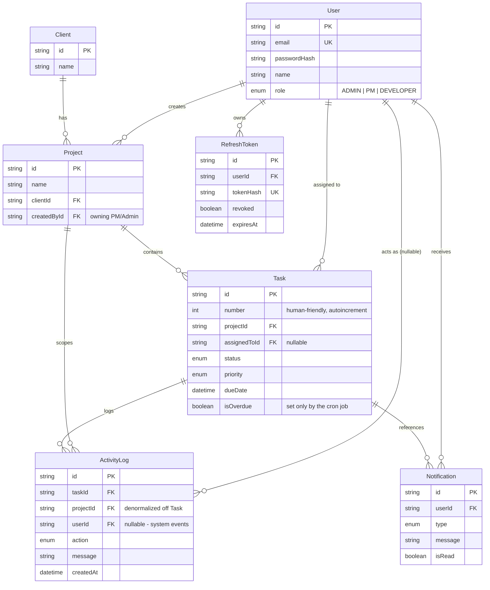

# Client Project Dashboard

Internal dashboard for a small agency to manage client projects, assign tasks, and see what's happening across the team in real time.

- **Live app:** https://velozity-dashboard-two.vercel.app (frontend is live — you'll need to spin up the backend with the Render blueprint below for it to actually do anything, see Deployment)
- **Repo:** https://github.com/aayush-arya/velozity-fullstack

## Stack

- **Frontend:** React + TypeScript, Vite, React Router, TanStack Query, Tailwind
- **Backend:** Node + Express + TypeScript
- **DB:** PostgreSQL + Prisma
- **Real-time:** Socket.io
- **Background jobs:** node-cron
- **Auth:** JWT access token (kept in memory on the client) + refresh token in an HttpOnly cookie

## Why these choices

**Socket.io, not raw WebSocket.** The feed needs to reach specific people (a task's assignee, the project's PM, every admin) not just "everyone connected," so I need rooms. I also wanted a handshake step to reject bad tokens before a socket joins anything, and reconnect handling for the "catch me up after I was offline" requirement. Socket.io gives me all of that for free — with plain `ws` I'd have had to build a room registry and reconnect logic myself, which felt like reinventing something a library already does well.

**node-cron, not Bull.** The overdue check is one query on a timer, nothing fancier — no retries, no distributed workers, no queue really needed. Bull would mean adding Redis just to run something `setInterval` can do. If this ever needed to scale to multiple workers I'd revisit it, but for now it'd be overkill.

**Express, not Fastify.** Honestly this one's mostly familiarity — Fastify's faster on paper but the bottleneck here is always going to be Postgres, not routing overhead. Express also has more middleware I needed off the shelf (rate limiting, helmet, request logging).

**Token storage.** Access token lives in memory only, never localStorage — gone on refresh/tab close, which limits how much damage an XSS bug could do. Refresh token is HttpOnly + SameSite, so JS on the page can't touch it at all, and it's stored hashed in the DB and rotated every time it's used (old one gets marked revoked). On page load the app just calls `/auth/refresh` once to get a new access token from the cookie.

**Prisma over raw SQL.** Mostly for the type safety — the Role/Status/Priority enums are shared between schema and code instead of me keeping two copies in sync by hand, and migrations come for free.

## Database



Full schema, with comments on every field: [`backend/prisma/schema.prisma`](backend/prisma/schema.prisma).

Indexes I actually added and why:
- `Task(projectId)`, `Task(assignedToId)`, `Task(status)`, `Task(priority)`, `Task(dueDate)`, plus `Task(projectId, status)` and `Task(assignedToId, status)` — these are the exact columns the board, the dev dashboard, the overdue sweep, and the filter query params all filter/sort by.
- `ActivityLog.projectId` — this is copied over from `Task` on purpose. The activity feed needs to be filtered by project (PM view) or by "my tasks" (dev view) constantly, and I didn't want every feed query to join through `Task` just to get there. Paired with `createdAt` it's a straight indexed scan for both the live feed and the "give me the last 20" catch-up query.
- `Notification(userId, isRead, createdAt)` — the unread badge and the notification list are both "where userId = me, maybe unread, newest first."
- `RefreshToken.tokenHash` (unique) — every refresh call is a lookup by hash.
- `User.role` — almost every admin/PM screen starts by filtering to one role.

## Real-time events

| Event | Who gets it | What it means |
|---|---|---|
| `activity:new` | task's assignee, project's PM/owner, all admins | something changed on a task |
| `notification:new` | one specific user | `{ notification, unreadCount }` |
| `presence:update` | admins only | `{ onlineCount }` |

Auth happens once, when the socket connects — it sends the same access token used for REST calls, and the server verifies it before letting the socket join any room. Recipients for an event are worked out server-side (who owns this task/project) at the moment it happens, not from anything the client asked to subscribe to.

For the "I was offline, catch me up" requirement: `GET /api/activity?limit=20` runs the exact same role-scoped query as the initial feed load — there's no separate in-memory buffer anywhere. The frontend calls it on mount and again on every socket `connect` event (which also fires after a reconnect), so a client that dropped its connection re-syncs from Postgres instead of trusting whatever it had in memory.

## Access control

Every protected route goes through two checks:
1. `authenticate` — verifies the JWT signature and pulls `req.user` off the *signed* payload. You can't just edit the role claim in a token without breaking the signature.
2. `authorize(...roles)` at the route level, plus per-resource ownership checks in the service files — e.g. a PM's project queries always have `project.createdById = req.user.id` baked in, and a developer's task queries are always forced to `assignedToId = req.user.id`, no matter what the request's query string says.

The frontend also hides nav links/routes a user shouldn't see, but that's just UX — it's not doing any of the actual enforcement.

## Running it locally

**With Docker (easiest):**

```bash
git clone https://github.com/aayush-arya/velozity-fullstack.git
cd velozity-fullstack
cp backend/.env.example backend/.env
cp frontend/.env.example frontend/.env
docker compose up -d postgres
cd backend && npm install && npx prisma migrate deploy && npm run seed
```

Then run both dev servers:

```bash
# terminal 1
cd backend && npm run dev      # http://localhost:4100

# terminal 2
cd frontend && npm install && npm run dev   # http://localhost:5180
```

Postgres runs on port **5435** in docker-compose (not 5432) so it doesn't clash with anything else you might already have running — change it plus the matching `.env` values if you don't need to worry about that. Same story for 4100/5180, just pick whatever's free on your machine and update the `.env` files to match.

**Without Docker:** point `DATABASE_URL` at any Postgres 14+ you've got, then run the same `npx prisma migrate deploy && npm run seed && npm run dev` in `backend/`, and `npm run dev` in `frontend/`.

### Demo accounts

Password for all of them: **`Password123!`**

- Admin: `admin@agency.dev`
- PM: `pm1@agency.dev`, `pm2@agency.dev`
- Developer: `dev1@agency.dev`, `dev2@agency.dev`, `dev3@agency.dev`, `dev4@agency.dev`

`npm run seed` wipes and recreates everything: 1 admin, 2 PMs, 4 devs, 2 clients, 3 projects with 6 tasks each spread across every status, 3 tasks already overdue, and enough activity log / notification history that the feed and notification bell aren't empty the first time you log in.

## Deployment

Frontend is a static Vite build, so it deploys straight to Vercel. The backend holds long-lived WebSocket connections and runs its own cron scheduler in-process, so it needs an actual persistent server, not a serverless function — it's deployed separately.

**Frontend** is already live at the URL above (Vercel project `velozity-dashboard`), built with `VITE_API_URL` pointed at the backend.

**Backend** deploys via the `render.yaml` blueprint in this repo:
1. On Render: New → Blueprint → connect `aayush-arya/velozity-fullstack`. It reads `render.yaml` and sets up the web service. It does **not** provision a database — Render's free tier only allows one active free Postgres per account, so the blueprint leaves `DATABASE_URL` for you to fill in instead of fighting over that.
2. Once the service exists, go to its Environment tab and set `DATABASE_URL`. Either point it at a Postgres instance you already have on Render, or spin up a free one on [Neon](https://neon.tech) — either works, Prisma doesn't care who's hosting it.
3. Redeploy so it picks up the new env var. `prisma migrate deploy` runs automatically as part of the start command.
4. One time only — open the service's Shell tab and run `npm run seed`. Didn't wire this into the start command on purpose, so a later restart never quietly wipes out real activity.
5. If you rename the service from `velozity-dashboard-api`, update `CORS_ORIGIN` in `render.yaml` and the `VITE_API_URL` env var on Vercel to match, then redeploy both.

Render's free tier sleeps after inactivity, so the first request after a while will be slow while it wakes up.

## Known limitations

- Presence and socket rooms live in one in-process `Map`. Fine for a single server, but it wouldn't share state across multiple instances behind a load balancer — the real fix is the Socket.io Redis adapter, which I skipped for now since there's only one instance running.
- The overdue cron runs every 5 minutes, so a task can stay flagged overdue for up to 5 minutes after you push its due date out or mark it done. Deliberate trade-off for having a real background job do the flagging instead of computing it on every page load — the interval's a one-line env var if it needs to be tighter.
- Refresh token rotation catches reuse of an already-used token, but doesn't yet revoke *all* of a user's other sessions when that happens — a nice-to-have I didn't get to.
- No delete endpoints for projects/tasks, just create/update. Kept the surface area focused on what the brief actually grades.
- Rate limiting is only on `/auth/login` right now, not the whole API.
- Styling is plain functional Tailwind — I spent the time on access control and the real-time stuff instead of visual polish.
